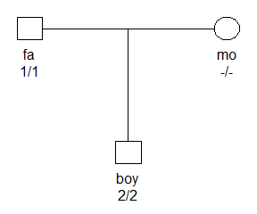

<!-- README.md is generated from README.Rmd. Please edit that file -->
pedmut
======

Installation
------------

Install from GitHub as follows:

``` r
# install.packages("devtools")
devtools::install_github("thoree/pedmut")
```

Introduction
------------

The `pedmut` package aims to provide a framework for modeling mutations in pedigree computations. Although the package is self-contained, its main purpose is to be imported by other packages, like [pedprobr](https://github.com/magnusdv/pedprobr), calculating pedigree likelihoods.

For a simple example, consider a situation where father and son are homozygous for different alleles at an autosomal marker with 4 alleles (1,2,3,4). The following code creates the pedigree and the marker, using a "proportional" model for mutations, and computes the likelihood:

``` r
library(pedprobr)
#> Loading required package: pedtools
library(pedtools)
x = nuclearPed(father = "fa", mother = "mo", child = "boy")
m = marker(x, fa = 1, boy = 2, alleles = 1:4, mutmod = "prop", rate = 0.1)
plot(x, marker = m)
likelihood(x, m)
#> [1] 0.0005208333
```



In the above code `pedmut` is involved twice: first in `marker()`, translating the arguments `mutmod = "prop"` and `rate = 0.1` into a complete mutation model. And secondly inside `likelihood()`, in order to speed up the computation by clustering the unobserved alleles 3 and 4 into one "lump". (The role of `pedmut` is to check that the mutation model allows this particular lumping, and to compute the lumped mutation matrix.)

To see details about the mutation model attached to a marker, we can use the `mutmod()` accessor:

``` r
mutmod(m)
#> Unisex mutation matrix:
#>            1          2          3          4
#> 1 0.90000000 0.03333333 0.03333333 0.03333333
#> 2 0.03333333 0.90000000 0.03333333 0.03333333
#> 3 0.03333333 0.03333333 0.90000000 0.03333333
#> 4 0.03333333 0.03333333 0.03333333 0.90000000
#> 
#> Model: proportional 
#> Rate: 0.1 
#> Frequencies: 0.25, 0.25, 0.25, 0.25 
#> 
#> Stationary: Yes 
#> Reversible: Yes 
#> Lumpable: Always
```

Mutation models
---------------

A mutation matrix is defined in `pedmut`, as a stochastic matrix with each row summing to 1, where the rows and columns are named with allele labels.

Two central functions of package are `mutationMatrix()` and `mutationModel()`. The former of these constructs a single mutation matrix according to various model specifications. The latter is a shortcut for producing what is typically required in practical applications, namely a list of *two* mutation matrices, named "male" and "female".

The mutations models currently implemented in `pedmut` are:

-   "equal" : All mutations equally likely; probability `1-rate` of no mutation. Parameters: `rate`.
-   "proportional" : Mutation probabilities are proportional to the target allele frequencies. Parameters: `rate`, `afreq`.
-   "random" : This produces a matrix of random numbers, each row normalised to have sum 1. Parameters: `seed`.
-   "custom" : Allows any valid mutation matrix to be provided by the user. Parameters: `matrix`.
-   "trivial" : Diagonal mutation matrix with 1 on the diagonal.
-   "stepwise" : Mutation rates depend on whether transitions are within the same group or not, i.e., between integer alleles (like '17') and microvariants (like '17.1'). Mutations also depend on the size of the mutation as modelled by the parameter 'range', the relative probability of mutating n+1 steps versus mutating n steps.

For example, the following creates a 3\*3 mutation matrix under the "equal" model:

``` r
pedmut::mutationMatrix("equal", rate = 0.1, alleles = 1:3)
#>      1    2    3
#> 1 0.90 0.05 0.05
#> 2 0.05 0.90 0.05
#> 3 0.05 0.05 0.90
#> 
#> Model: equal 
#> Rate: 0.1 
#> 
#> Lumpable: Always
```

The mutation matrix in Section 2.1.3 of Simonsson and Mostad (FSI: Genetics 2015) is obtained by

``` r
pedmut::mutationMatrix(model = "stepwise",
               alleles = c("16", "17", "18", "16.1", "17.1"),
               rate = 0.003, rate2 = 0.001, range = 0.5)
#>                16           17           18         16.1         17.1
#> 16   0.9960000000 0.0020000000 0.0010000000 0.0005000000 0.0005000000
#> 17   0.0015000000 0.9960000000 0.0015000000 0.0005000000 0.0005000000
#> 18   0.0010000000 0.0020000000 0.9960000000 0.0005000000 0.0005000000
#> 16.1 0.0003333333 0.0003333333 0.0003333333 0.9960000000 0.0030000000
#> 17.1 0.0003333333 0.0003333333 0.0003333333 0.0030000000 0.9960000000
#> 
#> Model: stepwise 
#> Rate: 0.003 
#> range:  0.5 
#> rate2:  0.001 
#> 
#> Lumpable: Not always
```

Model properties
----------------

Certain properties of mutation models are of particular interest - both theoretical and practical - for likelihood computations. The pedmut package provides utility functions for quickly checking whether a given model these properties:

-   `isStationary(M, afreq)` : Checks if `afreq` is a right eigenvector of the mutation matrix `M`
-   `isReversible(M, afreq)` : Checks if `M` together with `afreq` form a *reversible* Markov chain, i.e., that they satisfy the [detailed balance](https://en.wikipedia.org/wiki/Detailed_balance) criterion
-   `isLumpable(M, lump)` : Checks if `M` allows clustering ("lumping") of a given subset of alleles. This implements the neccessary and sufficient condition of *strong lumpability* of Kemeny and Snell: *Finite Markov Chains*, 1960
-   `alwaysLumpable(M)` : Checks if `M` allows lumping of any allele subset
