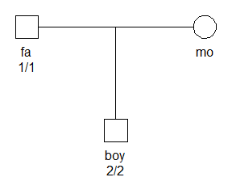

<!-- README.md is generated from README.Rmd. Please edit that file -->

# pedmut

<!-- badges: start -->

[](https://CRAN.R-project.org/package=pedmut)
[](https://cran.r-project.org/package=pedmut)
[](https://cran.r-project.org/package=pedmut)
<!-- badges: end -->

## Introduction

The **pedmut** package is part of the
[**pedsuite**](https://magnusdv.github.io/pedsuite/) ecosystem for
pedigree analysis in R. Its aim is to provide a framework for modelling
mutations in pedigree computations.

Although **pedmut** is self-contained, its main purpose is to be
imported by other **pedsuite** packages, like
[pedprobr](https://github.com/magnusdv/pedprobr) (marker probabilities
and pedigree likelihoods), [forrel](https://github.com/magnusdv/forrel)
(forensic pedigree analysis) and
[dvir](https://github.com/magnusdv/dvir).

For the theoretical background of mutation models and their properties
(stationarity, reversibility, lumpability), I recommend Chapter 5 of
[Pedigree analysis in
R](https://shop.elsevier.com/books/pedigree-analysis-in-r/vigeland/978-0-12-824430-2),
and the references therein.

## Installation

``` r
# The easiest way to get `pedmut` is to install the entire `pedsuite`:
install.packages("pedsuite")

# Alternatively, you can install just `pedmut`:
install.packages("pedmut")

# If you need the latest development version, install it from GitHub:
# install.packages("devtools")
devtools::install_github("magnusdv/pedmut")
```

## A simple likelihood example

The examples below require the packages **pedtools** and **pedprobr** in
addition to **pedmut**. The first two are core members of the pedsuite
and can be loaded collectively with `library(pedsuite)`.

``` r
library(pedsuite)
library(pedmut)
```

The figure below shows a father and son who are homozygous for different
alleles. We assume that the locus is an autosomal marker with two
alleles, labelled 1 and 2.

``` r
# Create pedigree
x = nuclearPed(father = "fa", mother = "mo", child = "boy")

# Add marker
x = addMarker(x, fa = "1/1", boy = "2/2")

# Plot with genotypes
plot(x, marker = 1)
```



The data clearly constitutes a *Mendelian error*, and gives a likelihood
of 0 without mutation modelling:

``` r
likelihood(x)
#> [1] 0
```

The following code sets a simple mutation model and recomputes the
pedigree likelihood.

``` r
x2 = setMutmod(x, model = "equal", rate = 0.1)

likelihood(x2)
#> [1] 0.0125
```

Under the mutation model, the combination of genotypes is no longer
impossible, yielding a non-zero likelihood. To see details about the
mutation model, we can use the `mutmod()` accessor:

``` r
mutmod(x2, marker = 1)
#> Unisex mutation matrix:
#>     1   2
#> 1 0.9 0.1
#> 2 0.1 0.9
#> 
#> Model: Equal 
#> Rate: 0.1 
#> Frequencies: 0.5, 0.5 
#> 
#> Bounded: Yes 
#> Stationary: Yes 
#> Reversible: Yes 
#> Lumpable: Always
```

## Mutation models

A mutation matrix in **pedmut** is a stochastic matrix, with each row
summing to 1, where the rows and columns are named with allele labels.

Two central functions of package are `mutationMatrix()` and
`mutationModel()`. The first constructs a single mutation matrix
according to various model specifications. The second produces what is
typically required in applications, namely a list of *two* mutation
matrices, named “male” and “female”.

The mutation models currently implemented in **pedmut** are:

- `equal`: All mutations equally likely; probability `1-rate` of no
  mutation. Parameters: `rate`.

- `proportional`: Mutation probabilities are proportional to the target
  allele frequencies. Parameters: `rate`, `afreq`.

- `onestep`: Applicable if all alleles are integers. Mutations are
  allowed only to the nearest integer neighbour. Parameters: `rate`.

- `stepwise`: For this model alleles must be integers or single-decimal
  microvariants (e.g. 17.1). Mutation rates depend on group (integer vs
  microvariant), with `rate` for same-group and `rate2` for
  between-group mutations. Mutations also depend on step size; the
  `range` parameter gives the relative probability of mutating n+1 steps
  versus n steps. Parameters: `rate`, `rate2`, `range`.

- `dawid`: A reversible stepwise mutation model, following the approach
  of Dawid et al. (2002). Parameters: `rate`, `range`.

- `random`: Generates a random mutation matrix, optionally conditioned
  on a fixed overall mutation rate. Parameters: `rate`, `seed` (both
  optional).

- `trivial`: Diagonal mutation matrix with 1 on the diagonal.
  Parameters: None.

- `custom`: Any valid mutation matrix provided by the user. Parameters:
  `matrix`.

## Model properties

Several properties of mutation models are of interest (both theoretical
and practical) for likelihood computations. The **pedmut** package
provides utility functions for quickly checking these:

- `isBounded(M, afreq)`: Checks if `M` is bounded by the allele
  frequencies, meaning that the probability of mutating into an allele
  never exceeds the population frequency of that allele. Unbounded
  models may give counter-intuitive results, like LR \> 1 in a paternity
  case where the alleged father and child have no alleles in common.

- `isStationary(M, afreq)`: Checks if `afreq` is a right eigenvector of
  the mutation matrix `M`. Stationary models have the desirable property
  that allele frequencies don’t change across generations.

- `isReversible(M, afreq)`: Checks if `M` together with `afreq` form a
  *reversible* Markov chain, i.e., that they satisfy the [detailed
  balance](https://en.wikipedia.org/wiki/Detailed_balance) criterion.

- `isLumpable(M, lump)`: Checks if `M` allows clustering (“lumping”) of
  a given subset of alleles. This implements the necessary and
  sufficient condition of *strong lumpability* of Kemeny and Snell
  (*Finite Markov Chains*, 1976).

- `alwaysLumpable(M)`: Checks if `M` allows lumping of *any* allele
  subset.

## Further examples

An `equal` model with rate 0.1:

``` r
mutationMatrix("equal", rate = 0.1, alleles = c("a", "b", "c"))
#>      a    b    c
#> a 0.90 0.05 0.05
#> b 0.05 0.90 0.05
#> c 0.05 0.05 0.90
#> 
#> Model: Equal 
#> Rate: 0.1 
#> 
#> Lumpable: Always
```

Next, a `proportional` model with rate 0.1. Note that this model depends
on the allele frequencies.

``` r
mutationMatrix("prop", rate = 0.1, alleles = c("a", "b", "c"), afreq = c(0.7, 0.2, 0.1))
#>            a          b          c
#> a 0.93478261 0.04347826 0.02173913
#> b 0.15217391 0.82608696 0.02173913
#> c 0.15217391 0.04347826 0.80434783
#> 
#> Model: Proportional 
#> Rate: 0.1 
#> Frequencies: 0.7, 0.2, 0.1 
#> 
#> Bounded: Yes 
#> Stationary: Yes 
#> Reversible: Yes 
#> Lumpable: Always
```

To illustrate the `stepwise` model, we recreate the mutation matrix in
Section 2.1.3 of Simonsson and Mostad (FSI:Genetics, 2015). This is done
as follows:

``` r
mutationMatrix(model = "stepwise", alleles = c("16", "17", "18", "16.1", "17.1"),
               rate = 0.003, rate2 = 0.001, range = 0.5)
#>                16           17           18         16.1         17.1
#> 16   0.9960000000 0.0020000000 0.0010000000 0.0005000000 0.0005000000
#> 17   0.0015000000 0.9960000000 0.0015000000 0.0005000000 0.0005000000
#> 18   0.0010000000 0.0020000000 0.9960000000 0.0005000000 0.0005000000
#> 16.1 0.0003333333 0.0003333333 0.0003333333 0.9960000000 0.0030000000
#> 17.1 0.0003333333 0.0003333333 0.0003333333 0.0030000000 0.9960000000
#> 
#> Model: Stepwise 
#> Rate: 0.003 
#> 
#> Lumpable: Not always
```

A simpler version of the `stepwise` model above, is the `onestep` model,
in which only the immediate neighbouring integers are reachable by
mutation. This model is only applicable when all alleles are integers.

``` r
mutationMatrix(model = "onestep", alleles = c("16", "17", "18"), rate = 0.04)
#>      16   17   18
#> 16 0.96 0.04 0.00
#> 17 0.02 0.96 0.02
#> 18 0.00 0.04 0.96
#> 
#> Model: Onestep 
#> Rate: 0.04 
#> 
#> Lumpable: Not always
```
